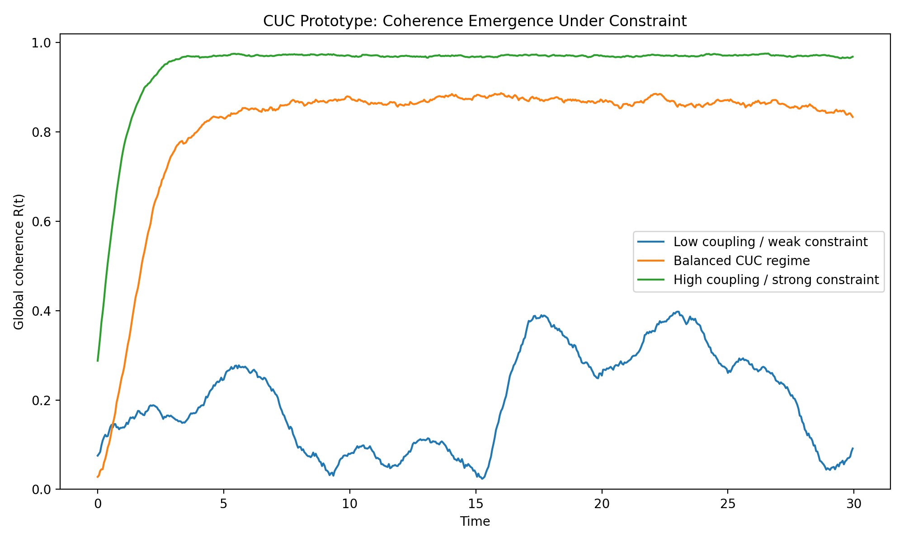
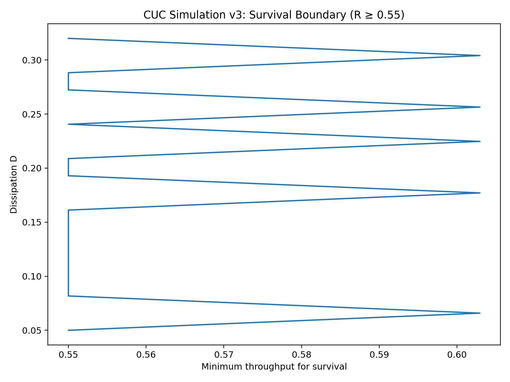
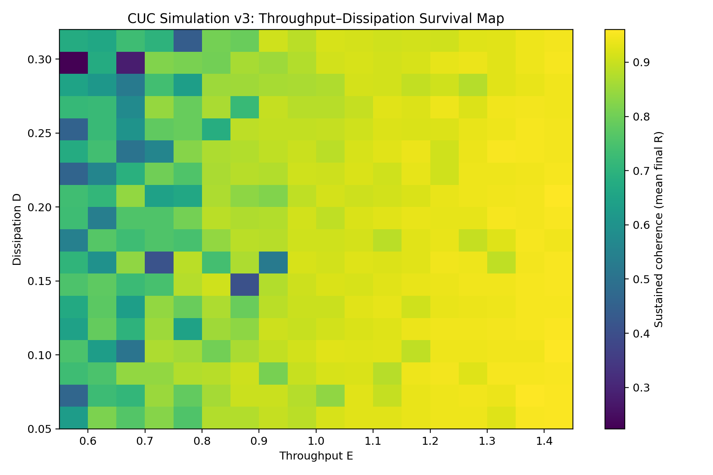
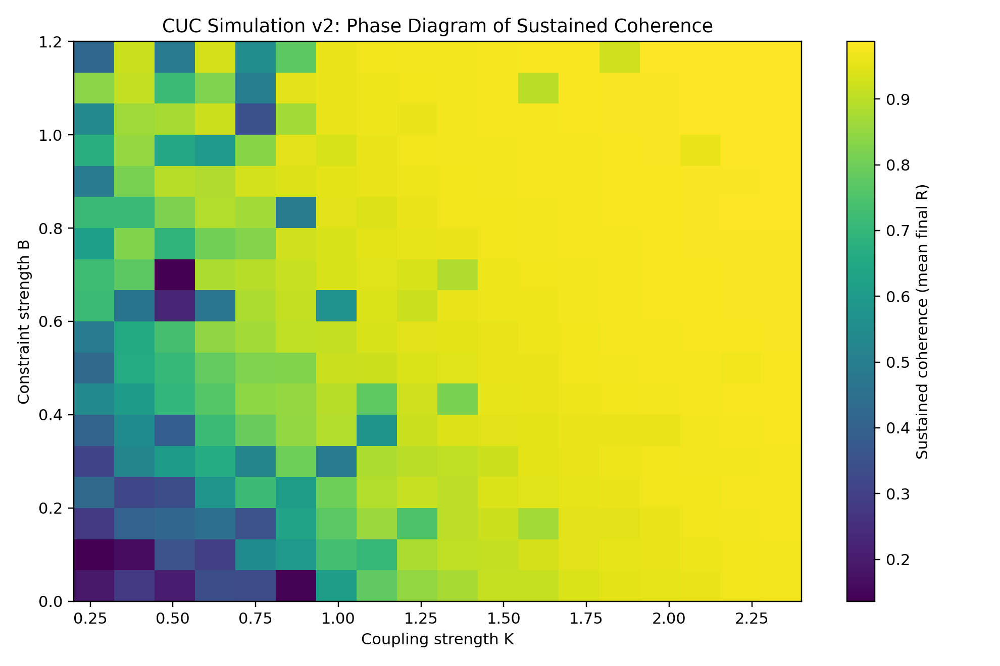
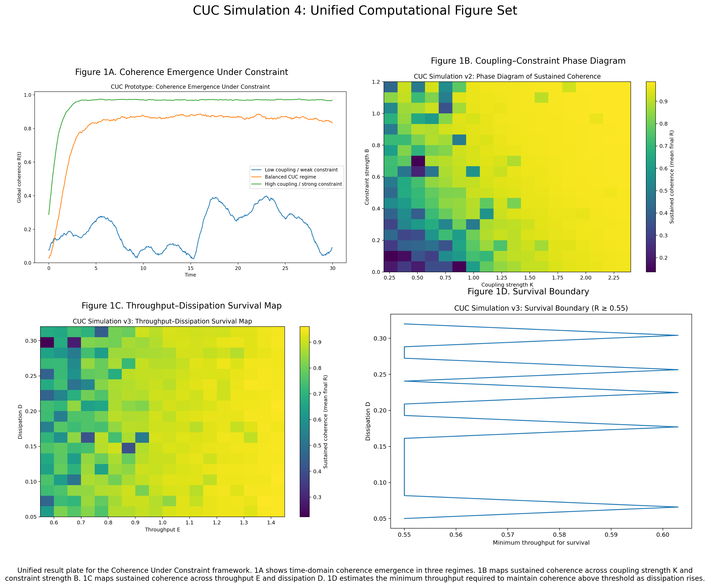

# Part II — Formal Mathematical Framework of Coherence Under Constraint

---

## 11. Mathematical Foundations

The Coherence Under Constraint (CUC) framework treats structure as the result of interacting dynamical elements subject to boundary conditions.

To formalize this idea, we define:

- a state space describing system dynamics  
- a measure of coherence across system elements  
- a representation of constraints  
- an evolution rule describing system behavior over time  

We begin with a generalized dynamical system.

---

## 12. System Representation

Let a system consist of \( N \) interacting elements.

Each element has a state vector:

\[
x_i(t)
\]

where \( i = 1, \dots, N \)

The full system state is:

\[
X(t) = \{x_1(t), x_2(t), ..., x_N(t)\}
\]

The evolution of the system follows:

\[
\frac{dx_i}{dt} = f_i(X, C, t)
\]

where:
- \( f_i \) = interaction dynamics  
- \( C \) = constraint set  

---

## 13. Constraint Operator

Constraints can be represented as:

\[
C(X) = 0
\]

or as a bounded region:

\[
X \in \Omega
\]

where \( \Omega \) is the constraint manifold.

| System            | Constraint Manifold        |
|------------------|--------------------------|
| Quantum system   | Allowed energy states     |
| Chemical system  | Reaction pathways         |
| Organism         | Metabolic limits          |
| Economy          | Regulatory structure      |

Constraints define the geometry of possible system trajectories.

---

## 14. Phase Representation

For oscillatory systems:

\[
x_i(t) = A_i e^{i\phi_i(t)}
\]

where:
- \( A_i \) = amplitude  
- \( \phi_i \) = phase  

This allows coherence to be expressed via phase alignment.

---

## 15. Coherence Metric

Using a Kuramoto-style order parameter:

\[
R(t) = \frac{1}{N} \left| \sum e^{i\phi_i(t)} \right|
\]

### Figure 1A — Coherence Emergence Under Constraint

*Figure 1A. Simulation of global coherence R(t) under varying coupling and constraint regimes. The balanced regime produces sustained coherence, validating the CUC stability condition.*

where \( R \in [0,1] \)

**Interpretation:**

- \( R \approx 0 \) → incoherent  
- \( R \approx 1 \) → coherent  

---

## 16. Constraint Energy Landscape

Let:

\[
V(X)
\]

be the constraint potential.

System evolution:

\[
\frac{dX}{dt} = -\nabla V(X) + \text{interaction terms}
\]

Minima of \( V \) correspond to **coherence basins**.

---

## 17. Coherence Basin Formalism

Define:

\[
B_k = \{ X \mid \nabla V(X) = 0 \ \text{and stability holds} \}
\]

| System        | Basin Example        |
|--------------|--------------------|
| Physics      | Crystal structure   |
| Biology      | Morphology          |
| Neuroscience | Neural pattern      |
| Sociology    | Institutional order |

---

## 18. Entropy–Coherence Relationship

Define coherence entropy:

\[
S_c = - \sum p_i \log p_i
\]

where \( p_i \) = probability of phase alignment.

As coherence increases:

\[
S_c \downarrow
\]

---

## 19. Energy Flow and Coherence Maintenance

Let:
- \( E_{in} \) = input energy  
- \( E_d \) = dissipation  

Condition:

\[
E_{in} \geq E_d
\]

### Figure 1C — Throughput–Dissipation Survival Map

### Figure 1D — Survival Boundary

Minimum throughput required to maintain coherence above threshold as dissipation increases. Defines the boundary of structural persistence.

Heatmap showing sustained coherence under varying throughput (E) and dissipation (D). Demonstrates the energetic requirement for maintaining structure.

---

## 20. Threshold Transition Condition

Let \( \lambda \) be a control parameter.

Transition occurs when:

\[
\lambda = \lambda_c
\]

### Figure 1B — Coupling–Constraint Phase Diagram

Phase diagram showing sustained coherence as a function of coupling strength (K) and constraint strength (B). The emergence of high-coherence regions demonstrates the existence of coherence basins.

At this point:

\[
\frac{\partial^2 V}{\partial X^2} = 0
\]

---

## 21. Interface Dynamics

Define:

\[
I = \Omega_A \cap \Omega_B
\]

Dynamics:

\[
\frac{dX_I}{dt} = f_A(X_A) + f_B(X_B) + \text{coupling}
\]

| Interface        | Effect                  |
|------------------|------------------------|
| Cell membrane    | Metabolic control      |
| Ecosystem edge   | Biodiversity increase  |
| Trade port       | Economic concentration |

---

## 22. Information–Coherence Relation

Mutual information:

\[
I(X_i ; X_j)
\]

Relationship:

\[
\text{Coherence} \propto I
\]

---

## 23. Multi-Scale Coherence

Let layers:

\[
L_1, L_2, ..., L_n
\]

Coherence propagates when:

\[
R_{L_k} \rightarrow R_{L_{k+1}}
\]

Example:

molecules → cells → organisms → societies

---

## 24. Unified Coherence Equation (Conceptual)

\[
\text{Structure}(t) = R(t) \times C(X) \times E_{flow}
\]

Condition:

\[
R(t) > R_{threshold}
\]

within constraint space.

---

## 25. Predictions of the Model

- Increasing fluctuations near transitions  
- Deep attractor basins in stable systems  
- High influence of interface regions  

---

## 26. Toward Empirical Testing

| Domain        | Measurement                |
|--------------|---------------------------|
| Neuroscience | Phase-locking value       |
| Ecology      | Population synchronization|
| Economics    | Market correlation        |
| Sociology    | Network coherence         |

### Figure 4 — Unified Computational Figure Set

Integrated visualization of the CUC computational framework, combining time-domain coherence emergence, phase diagrams, energy constraints, and survival boundaries.

---

## Closing of Part II

This section provides a preliminary formalization of the CUC framework using:

- dynamical systems theory  
- synchronization models  
- information theory  

Future work includes:

- numerical simulation  
- cross-domain empirical testing  
- refinement of coherence metrics  

---

➡️ *Next: Part III — Cross-Domain Applications*
